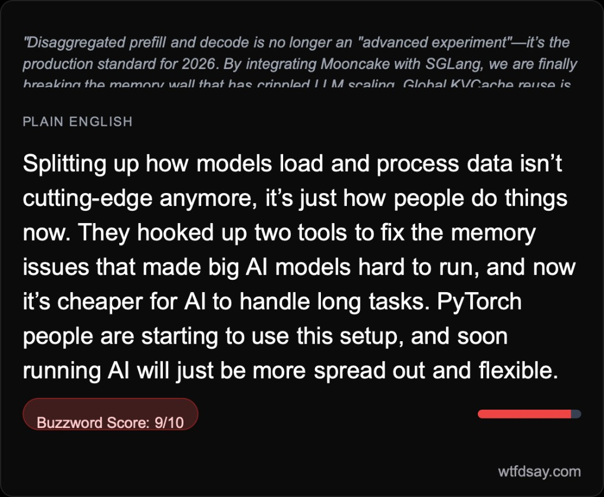

# wtf did they say?

Translating AI/tech/crypto Twitter into plain English.

**Live:** [wtfdsay.com](https://wtfdsay.com)



## What It Does

Paste any AI, tech, or crypto tweet and get back what the person actually said — in normal words. The app scores each tweet on a 0–10 buzzword scale, highlights the jargon, rewrites the whole thing in plain English, and lets you download a shareable image card of the translation.

## Why I Built It

I kept seeing tweets in the AI/tech space that sounded impressive but said very little. I wanted a tool that cuts through the noise — and a project that shows I build things that ship, not just prototypes.

## Tech Stack

- **Next.js 16** (App Router) on **Vercel**
- **React 19** with **TypeScript**
- **Tailwind CSS v4**
- **OpenAI API** (GPT-4.1) for translation and scoring
- **Upstash Redis** for rate limiting
- **html2canvas** for client-side share card export
- **GitHub Actions** CI (lint, typecheck, build)

## Key Features

- **Buzzword scoring** — a calibrated 0–10 scale with 12 scored reference tweets baked into the prompt so the model stays consistent
- **Phrase-level annotations** — individual jargon phrases get translated, not just the whole tweet
- **Adaptive UI** — low-scoring tweets get minimal treatment; high-scoring tweets surface more annotations and an explanation of *why* it sounds like that
- **Downloadable share cards** — branded PNG export rendered entirely client-side
- **Three-tier rate limiting** — per-minute, per-IP daily, and global daily limits via Upstash Redis, with graceful degradation in development

## How to Run Locally

```bash
git clone https://github.com/bayer4/wtfdsay.git
cd wtfdsay
npm install
```

Create a `.env.local` file at the project root:

```
OPENAI_API_KEY=your-openai-api-key
UPSTASH_REDIS_REST_URL=your-upstash-url
UPSTASH_REDIS_REST_TOKEN=your-upstash-token
```

Then start the dev server:

```bash
npm run dev
```

Open [http://localhost:3000](http://localhost:3000). The app works without Upstash credentials in development — rate limiting is bypassed locally so you only need the OpenAI key to get started.

## Architecture Notes

The interesting work here is in the prompt engineering and scoring calibration. Getting an LLM to assign a consistent buzzword score across wildly different tweets is harder than it sounds — the model wants to be generous. I solved this by building a `calibration.json` file with 12 hand-scored reference tweets spanning the full 0–10 range, which gets injected into the system prompt as scoring anchors. The prompt itself is heavily constrained: explicit voice rules, banned phrases, per-score-tier behavior (low-scoring tweets get left mostly alone instead of being unnecessarily rewritten), and a rubric that distinguishes stacked jargon from normal domain terms. On the infrastructure side, the rate limiting is split into three tiers — per-minute burst, per-IP daily, and global daily — each with its own Redis key strategy and TTL management, and the whole system gracefully degrades: skips limits in dev, returns 503 in production if Redis is down. It's a small app, but every layer has a reason behind it.
